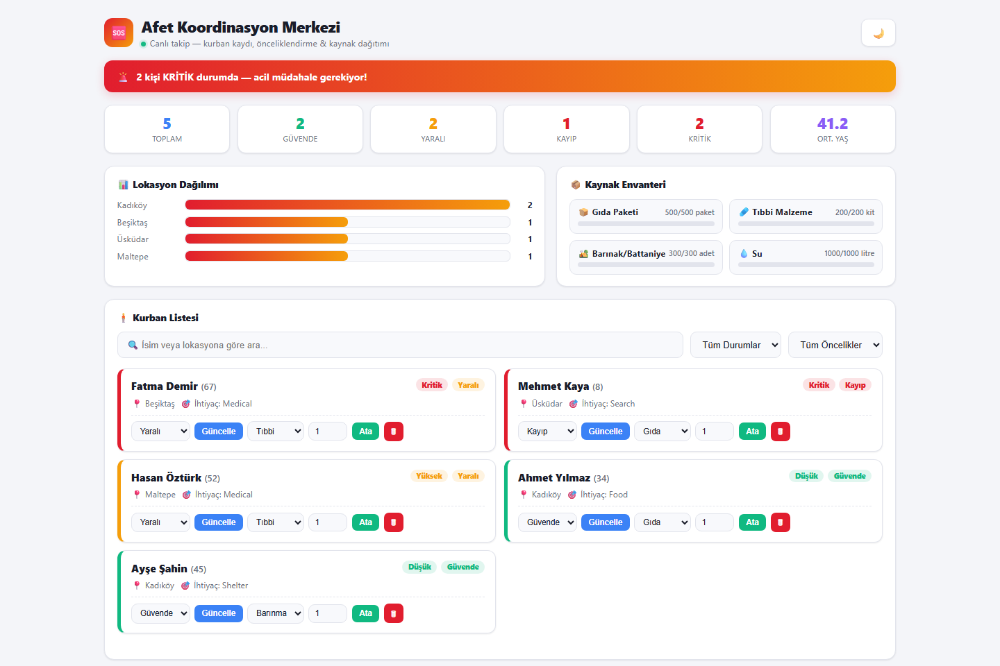

# Disaster Relief System


> A crisis coordination dashboard for registering disaster victims, auto-calculating response priority, and managing relief resource distribution in real time.

---

## Overview

During a disaster response, coordinators need to know who needs help most urgently and what supplies are left to send them. Disaster Relief System is a lightweight FastAPI web app that turns victim intake into a live coordination center: every victim gets an automatic priority score based on rule-based triage logic, and every relief resource (food, medical supplies, shelter, water) is tracked from stock to allocation, with the app suggesting the right resource for each victim's stated need.

This project started as a C command-line tool (`main.c`, kept for reference) and has been rebuilt as a full web application.



## Features

- **Automatic priority scoring** — every victim is triaged with rule-based logic: `Missing` status, age under 12, or age over 65 is scored **Critical**; `Injured` is **High**; `Safe` is **Low**; everything else falls to **Medium**. Victims are sorted by priority automatically.
- **Resource inventory management** — four resource types (food, medical supplies, shelter/blankets, water) with live stock, allocated, and remaining counts, plus percentage-used indicators.
- **Smart resource suggestions** — each victim's stated need (`food`, `medical`, `shelter`, `water`, `search`) is mapped to the matching resource type so coordinators know what to allocate next.
- **Crisis dashboard** — a live coordination center view with a critical-alert banner, summary stats (total, safe, injured, missing, critical count, average age), and a location-based distribution breakdown.
- **Priority-coded victim cards** — critical victims are flagged red, high priority orange, low priority green, for fast visual triage.
- **Full victim lifecycle** — register, search/filter by status and priority, update, and delete victim records.
- **Resource allocation with stock guards** — allocations are rejected if requested amount exceeds remaining stock.
- **Detailed statistics endpoint** — breakdowns by status, location, and priority for reporting.

## Tech Stack

- **Backend:** Python, FastAPI
- **Templating:** Jinja2
- **Frontend:** Vanilla JavaScript, HTML/CSS
- **State:** In-memory (no database required)
- **Server:** Uvicorn

## Project Structure

```
Disaster-Relief-System/
├── app/
│   ├── main.py            # FastAPI app — routes, priority logic, resource allocation
│   ├── requirements.txt   # Python dependencies
│   └── templates/         # Jinja2 templates (dashboard UI)
├── main.c                 # Original C implementation (reference)
├── Dockerfile
└── screenshot.png
```

## Run Locally

### Prerequisites

- Python 3.10+

### Steps

```bash
git clone https://github.com/ErdoganPeker/Disaster-Relief-System.git
cd Disaster-Relief-System/app

python -m venv .venv
.venv\Scripts\activate      # Windows
# source .venv/bin/activate  # macOS/Linux

pip install -r requirements.txt
python main.py
```

The app starts on **http://localhost:5012**.

## API Overview

| Method | Endpoint | Description |
|--------|----------|-------------|
| `GET` | `/` | Dashboard UI |
| `POST` | `/register` | Register a new victim |
| `GET` | `/victims` | List all victims (priority-sorted) |
| `GET` | `/search?q=` | Search victims by name or location |
| `PUT` | `/victims/{id}` | Update a victim record |
| `DELETE` | `/victims/{id}` | Remove a victim record |
| `GET` | `/resources` | View resource inventory |
| `POST` | `/resources/{type}/allocate` | Allocate a resource to a victim |
| `GET` | `/stats` | Aggregate statistics |

## Author

**Erdogan Yasin Peker** — Computer Engineer

[GitHub](https://github.com/ErdoganPeker) · [LinkedIn](https://www.linkedin.com/in/erdogan-yasin-peker-b107ba24b/)
